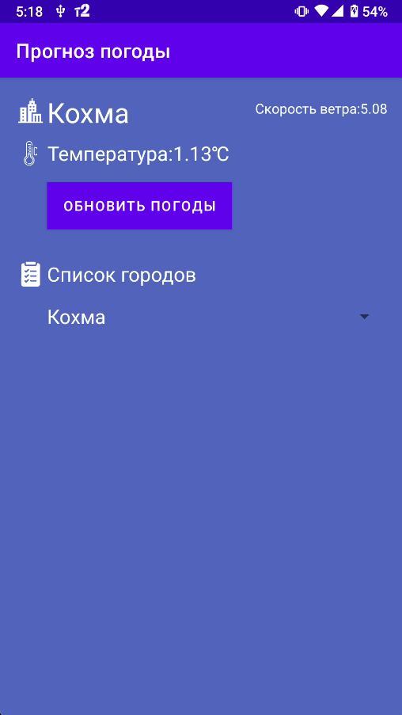
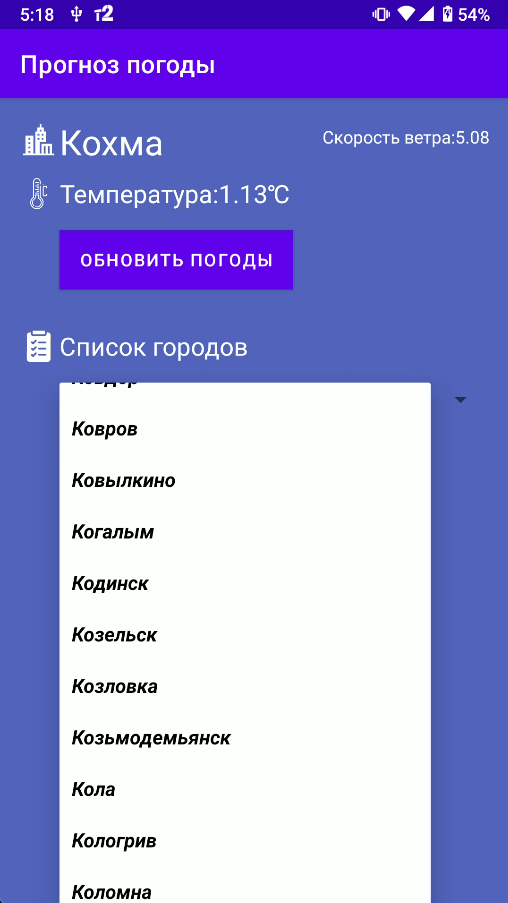

# Отображение погоды с помощью Data binding

## Настройка проекта

1. Нужно создать дубликат файла `secrets.defaults.properties` и переименовать в `secrets.properties` в корне проекта
2. Добавьте ключи для API сервисов в `secrets.properties`

# Задание #1

В этом задании мы работаем с уже известным нам API OpenWeatherMap для получения сведений о погоде.

Используйте [проект-заготовку](https://github.com/ipetrushin/CurrentWeatherDataBinding) для разработки приложения. В этом проекте уже подключены нужные библиотеки и реализован запрос к API с помощью корутин Kotlin.

- Разработайте интерфейс включая тег `<data>` для описания использованных данных
- Осуществите привязку данных
- Реализуйте выбор города и обновление данных погоды

[Проект с занятия](https://github.com/ipetrushin/DatabindingDemo) и [запись](https://youtu.be/fTMAzbjMSrA)

## Дополнительные данные

Города России в формате JSON были взяты из этого [репозитория](https://github.com/pensnarik/russian-cities)

## Демонстрация работы

|  |  |
| --------------------- | --------------------- |

# Задание #2

Используя ConstraintLayout сделайте вёрстку интерфейса приложения для отображения погоды, которое разработано на прошлом занятии.

## Демонстрация работы

|  |  |
| --------------------- | --------------------- |